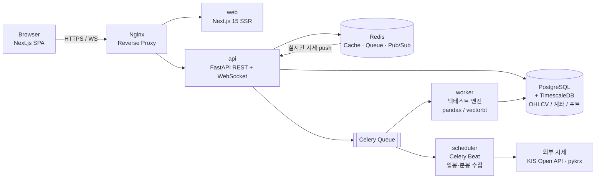

# PRD — 주식 매매 시뮬레이터 (Web)

| 항목 | 내용 |
|---|---|
| 제품명 | StockLab (가칭) — 백테스트 + 실전매매 기록 + 자산 대시보드 통합 웹 |
| 목표 | 전략을 **검증(백테스트) → 실행(실전매매 기록) → 관리(대시보드)** 하는 하나의 루프를 한 화면 흐름 안에서 제공 |
| 대상 | 국내 주식 개인 투자자 중 전략 검증에 관심 있는 중급 사용자 |
| 성공 지표 | 백테스트 1회 이상 실행 유저 60%, 백테스트→실전 포트 전환율 20%, 주간 재방문 40% |
| 범위 외 (v1) | 실제 주문 체결(증권사 실주문), 파생·해외주식, 소셜/커뮤니티 |

---

## 1. 시스템 구성도

**설계 원칙** — 조회(API)와 계산(worker)을 분리해 백테스트 장시간 작업이 UI를 막지 않게 하고, 진행률·결과는 Redis Pub/Sub → WebSocket으로 스트리밍한다. 시세 원본은 TimescaleDB 하이퍼테이블 1곳에 정규화 저장해 차트·백테스트·실전매매가 동일 데이터를 사용한다.

## 2. 개발 환경 (docker compose 기준)

| 서비스 | 이미지/스택 | 포트 | 비고 |
|---|---|---|---|
| `nginx` | nginx:alpine | 80/443 | 라우팅, WS 업그레이드, gzip |
| `web` | node:22 / Next.js 15 + TS + Tailwind v4 + shadcn/ui | 3000 | 차트: TradingView **Lightweight Charts v5**(Apache-2.0, 지표 자체 구현) |
| `api` | python:3.12 / FastAPI + SQLAlchemy + Pydantic v2 | 8000 | REST + `/ws` 실시간 |
| `worker` | 동일 이미지 / Celery worker | – | 백테스트 실행, `concurrency=4` |
| `scheduler` | 동일 이미지 / Celery beat | – | 장 마감 후 시세 수집 배치 |
| `db` | timescale/timescaledb-ha:pg16 | 5432 | volume `pgdata` |
| `redis` | redis:7-alpine | 6379 | 캐시 + 브로커 |

- 파일 구성: `docker-compose.yml`(공통) + `docker-compose.override.yml`(개발: 소스 bind mount, hot reload) + `docker-compose.prod.yml`(멀티스테이지 빌드, replica)
- 환경변수는 `.env` 단일 관리(`KIS_APP_KEY`, `DATABASE_URL`, `REDIS_URL`), `.env.example` 커밋
- 전체 기동 `docker compose up -d` 한 줄, 초기 시세 시딩 `docker compose run --rm api python -m scripts.seed --years 10`
- 모든 서비스 `healthcheck` 정의 + `depends_on: condition: service_healthy`, CI(GitHub Actions)에서 동일 compose로 e2e 실행

## 3. UX/UI — 레퍼런스 검토 결과 및 적용안

직접 확인한 레퍼런스와 도출한 구조(TradingView Supercharts, 젠포트, 네이버페이 증권, Mercury/Ramp 계열 핀테크 대시보드):

| 레퍼런스 | 확인한 UX 구조 | 본 제품 적용 |
|---|---|---|
| TradingView Supercharts | 4-툴바 골격 — 상단(종목검색·주기·차트타입·지표), 좌측(드로잉), 우측(관심종목·상세·뉴스), 하단(전략테스터·페이퍼트레이딩 패널). 워크스페이스를 "레이아웃"으로 저장/전환 | 동일 4-툴바 골격 채택. 하단 패널을 **백테스트 결과 탭**으로 사용, 차트 설정은 "레이아웃"으로 저장 |
| 젠포트 | 백테스트를 **조건 설정 → 실행(진행률 표시) → 결과 확인** 3스텝 위저드로 분리. 조건은 유니버스/관심종목/제외종목 탭 + 투자금액·수수료율·비중·보유기간 상세설정 | 시뮬레이터 메뉴를 동일 3스텝으로 구성, 좌측 폼 / 우측 실시간 프리뷰 |
| 네이버페이 증권 | 종목 상세 1페이지에 차트·현재가·호가·공시·뉴스·재무를 앵커 탭으로 수직 배치, 관심종목 그룹 관리 | 종목 상세는 앵커 탭 + sticky 현재가 헤더 |
| Mercury·Ramp·Revolut 등 | "총 잔액 1개 숫자"를 최상단 최대 타입으로 두고 아래로 점진 공개(progressive disclosure). 트레이딩 도구는 다크 우선 | 대시보드 최상단 = 총자산 단일 히어로 수치 |

**디자인 원칙 (2026 패턴 반영)**
1. **다크 모드 우선, 단일 액센트** — 다크는 차별점이 아니라 기본값. 순검정 대신 `#111117` 계열 표면 + 액센트 1색, 손익 색은 WCAG AA 대비 검증. 상승=적/하락=청(국내 관례) + 색약 대비 토글 제공.
2. **베이스 그리드는 벤토(bento)** — 타일 크기 차이로 위계 표현(히어로 타일 6열, 상태 타일 2×2). 화면당 히어로 타일은 2개 이하.
3. **숫자 가독성** — `font-variant-numeric: tabular-nums` 전역 적용(실시간 갱신 시 열 흔들림 방지), 금액은 monospace 톤.
4. **점진 공개** — 첫 화면은 판단에 필요한 3~5개 지표만, 드릴다운에서 상세. 밀도를 밀도로 보상하지 않는다.
5. **수수료·세금·슬리피지·시세 지연을 숨기지 않는다** — 화면 내 상시 표기(신뢰 요소).
6. 반응형: 데스크톱 3-컬럼 → 태블릿 2-컬럼 → 모바일 단일 컬럼 + 하단 탭바. 접근성 WCAG 2.2 AA.

## 4. 기능 요구사항

### 4.1 주식 차트 (HTS 수준)
- 캔들/바/라인/Heikin-Ashi, 주기 1·3·5·15·30·60분 / 일 / 주 / 월, 로그·퍼센트 스케일
- 멀티 페인: 메인(가격+이동평균·볼린저·일목·VWAP) + 서브(거래량, RSI, MACD, 스토캐스틱, OBV, 외국인·기관 수급)
- 크로스헤어 + OHLC 레전드, 마우스휠 줌·드래그 팬, 드로잉(추세선·수평선·채널·피보나치·텍스트) — 종목별 저장
- 캔들 5만 개 이상에서도 60fps(canvas 렌더), 매수/매도 시점 마커·평단선·목표가/손절선 오버레이
- 리플레이 모드: 과거 특정 시점부터 바 단위 전진 재생(수동 매매 연습)

### 4.2 매매 시뮬레이터 (백테스트) — 3스텝 위저드
- **Step 1 조건 설정**: 자본금(초기 예수금) / 기간(시작·종료) / 기준봉 / 유니버스(KOSPI·KOSDAQ·업종·관심종목·제외종목 탭) / 최대 보유종목 수 / 종목당 비중(균등·비중지정) / 매수 조건(지표 조건식 AND·OR 조합) / 매도 조건(지표·목표수익률·손절률·트레일링스톱·보유기간 만료) / 분할매수·분할매도 / 리밸런싱 주기 / 비용(수수료율·거래세·슬리피지) — 프리셋 저장 및 복제
- **Step 2 실행**: 비동기 잡 + 진행률 바(WS), 취소 가능
- **Step 3 결과**: 총수익률·CAGR·MDD·샤프·승률·손익비·거래횟수 KPI 타일 / 자산곡선 vs KOSPI 벤치마크 / 월별 수익률 히트맵 / 낙폭(underwater) 차트 / 거래내역 테이블(CSV 내보내기) / 파라미터 스윕 비교(최대 5개 전략 오버레이)
- 결과 화면에서 **"실전매매로 전환"** 버튼 → 동일 파라미터로 실전 포트 생성

### 4.3 실전 매매 메뉴 (매수 시점 기준 수익률)
- 매수 등록: 종목·수량·매수단가·매수일시(수동 입력 또는 차트 클릭), 추가매수 시 평단 자동 재계산
- 핵심 화면 = **매수 시작 시점 기준 수익률 카드**
  - 종목 수익률 `= (현재가 − 매수평균가) / 매수평균가 × 100`, 비용 포함/제외 토글
  - 평가손익 금액, 보유일수, 연환산 수익률, 최고·최저 도달 수익률, 목표가·손절가 진행 바
  - 계좌 수준: 실현손익 / 미실현손익 / 기간수익률(TWR) / 입출금 반영 수익률(XIRR)
- 종목 차트에 매수 시점 마커 + 평단 수평선 + 매수 이후 구간 음영 표시
- 목표·손절 도달 알림(브라우저 푸시), 매매일지 메모 및 태그

### 4.4 대시보드
- 벤토 그리드. 상단 히어로: **총자산 1개 숫자** + 전일대비 증감(금액·%) + 전체 기간 수익률
- 자산 구성 도넛: 주식 / 현금(예수금·예금) / 기타(채권·펀드·금·코인·부동산 등 수동 등록)
- 주식 자산 현황: 보유 종목 테이블(종목·수량·평단·현재가·평가금액·손익·비중·보유일), 비중 상위 5 막대, 업종 분산
- 자산 추이 라인(1M/3M/6M/1Y/전체), 일간 손익 캘린더 히트맵
- 진행 중 포트 요약(백테스트 포트 / 실전 포트 성과 비교), 알림·이벤트 피드
- 시세 기준시각 및 지연 여부 상시 표기

## 5. 데이터·비기능 요구사항

| 구분 | 요구사항 |
|---|---|
| 데이터 소스 | 일봉·분봉·재무: KIS Open API + pykrx 보조. 장 마감 후 일괄 수집, 장중은 폴링/WS |
| 주요 API | `POST /backtests` `GET /backtests/{id}` `GET /ohlcv` `POST /positions` `GET /portfolio/summary` `WS /ws/quotes` `WS /ws/backtests/{id}` |
| 성능 | 차트 초기 로드 p95 < 1.5s, 일봉 5년·단일 종목 백테스트 < 5s, 유니버스 전체 < 60s |
| 정합성 | 백테스트는 종가 기준 익일 체결·look-ahead 방지, 수정주가 적용, 거래정지·상장폐지 종목 처리 |
| 보안 | JWT + refresh, 외부 API 키는 서버 보관, 개인 계좌정보 암호화(AES-GCM) |
| 고지 | 모의·과거 데이터 기반이며 투자 권유가 아님을 시뮬레이터·실전 화면에 명시 |

## 6. 마일스톤

| 스프린트 | 산출물 |
|---|---|
| M1 (2주) | compose 환경, 시세 수집 파이프라인, 종목 검색·차트 v1 |
| M2 (3주) | 차트 지표·드로잉, 백테스트 엔진 + 3스텝 위저드 |
| M3 (2주) | 실전매매 등록·수익률 화면, 알림 |
| M4 (2주) | 대시보드 벤토 레이아웃, 다크/라이트 테마, 반응형·접근성 QA |
